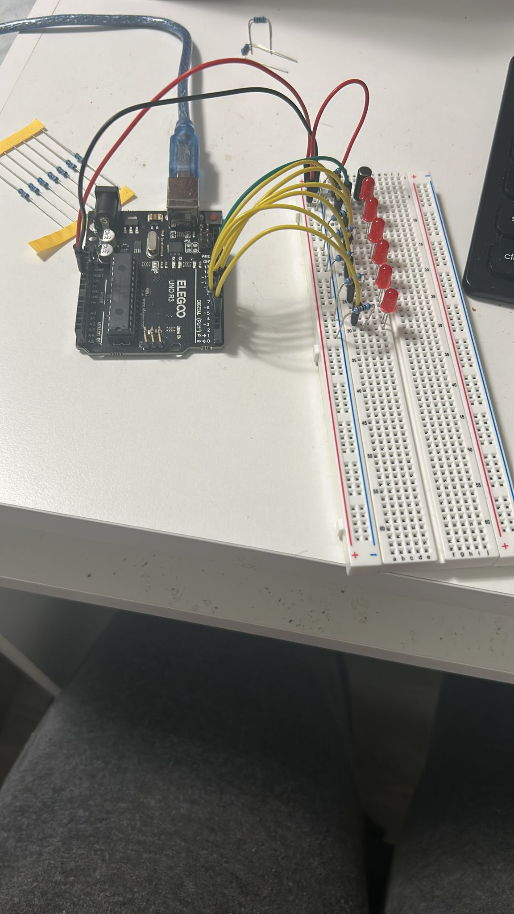
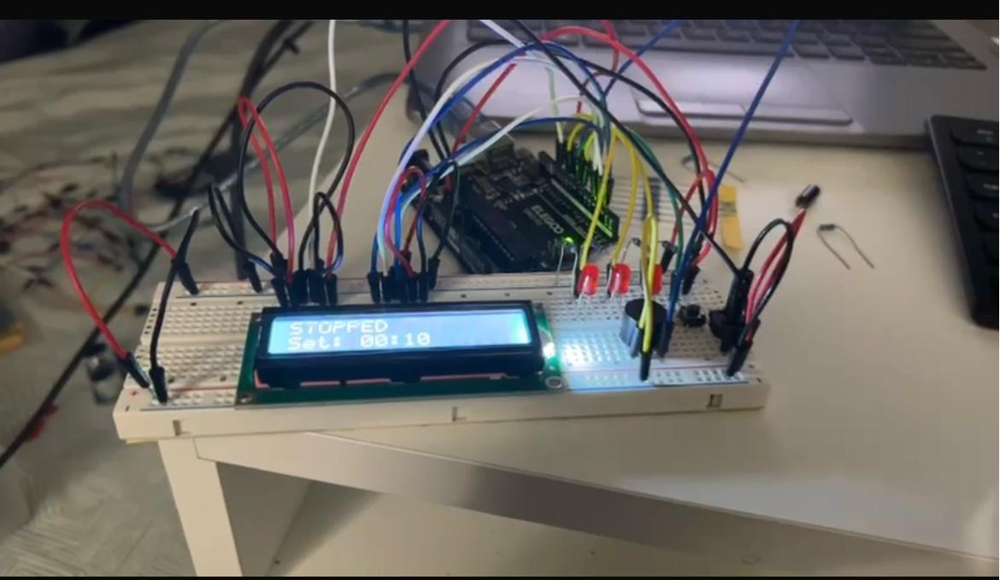
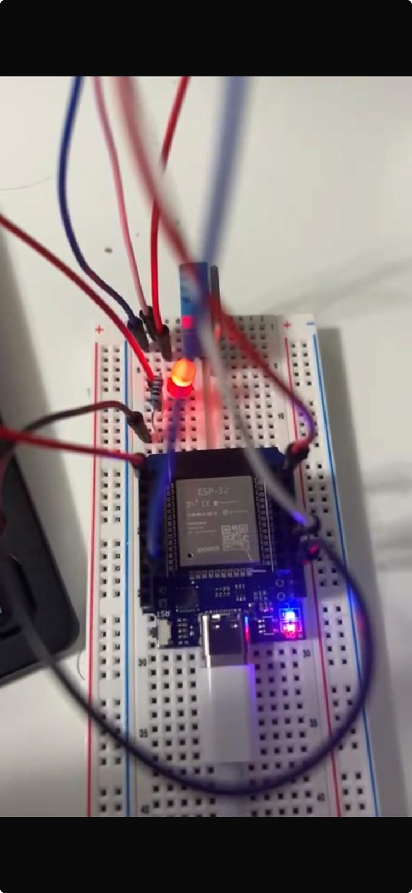

# Embedded Projects (Arduino UNO R3 + ESP32)

Hands-on embedded systems projects built with the **Elegoo Super Starter Kit UNO R3** and a **D1 MINI ESP32**. This repo focuses on practical hardware + software integration: GPIO, PWM, analog sensing, timing/state machines, and (on ESP32) Wi‑Fi networking.

**Recruiter quick links:** [LinkedIn](https://www.linkedin.com/in/mcamiloferraro/) • [GitHub](https://github.com/MatheusFerraro) • [Email](mailto:matheus.ferraro@gmail.com)

## Demo videos (highlights)

- Spaceship Interface (5 LEDs): https://youtu.be/WdyKd84uqG8
- Love‑O‑Meter (thermistor sensor): https://youtu.be/UMkDHPC7y6E
- Color Mixing Lamp (RGB LED / PWM): https://youtu.be/JklAYpaWLx0
- Servo Mood Indicator ("Mood Cue"): https://youtu.be/9OmnrQOTh3w
- Digital Hourglass (LCD): https://youtu.be/fsw4pIsPKsk

## Media (GIF + photos)

| Color Mixing Lamp (GIF) | Spaceship Interface | Digital Hourglass | ESP32 (temp/humidity setup) |
|---|---|---|---|
|  |  |  |  |

## Why this repo 

These projects show that I can:

- Translate requirements into working hardware prototypes
- Debug electronics + firmware using **Serial logs**, incremental testing, and clean pin mapping
- Write readable Arduino‑style C++ with simple abstractions (helper `.h/.cpp` where useful)
- Work across two common microcontroller platforms: **ATmega328P (UNO)** and **ESP32**

## Project map

| Project | Platform | What it demonstrates | Code | Demo |
|---|---|---|---|---|
| Spaceship Interface | Arduino UNO | Digital output, LED sequencing, button input basics | `SpaceshipInterface/SpaceshipInterface_Assignment1.ino` | https://youtu.be/WdyKd84uqG8 |
| Love‑O‑Meter | Arduino UNO | Analog sensing (thermistor), thresholds, calibration mindset | `Love-o-Meter/Love-o-Meter_Assignment2.ino` | https://youtu.be/UMkDHPC7y6E |
| Color Mixing Lamp | Arduino UNO | PWM, RGB mixing, sensor feedback structure | `ColorMixingLamp/ColorMixingLamp_Assignment3.ino` | https://youtu.be/JklAYpaWLx0 |
| Servo Mood Indicator | Arduino UNO | Servo control + mapping input → output behavior | `ServoMoodIndicator/ServoMoodIndicator_Assignment4.ino` | https://youtu.be/9OmnrQOTh3w |
| Digital Hourglass | Arduino UNO | Timing/state, LCD output, helpers split into utils | `DigitalHourglass/DigitalHourglass_Assignment5.ino` | https://youtu.be/fsw4pIsPKsk |
| Connecting Wi‑Fi | ESP32 | Wi‑Fi connect flow + status reporting | `Connecting_Wifi/Connecting_Wifi.ino` | — |
| Wi‑Fi + Sending Response | ESP32 | Basic networking flow and response handling | `Connecting_Wifi_SendingResponse/Connecting_Wifi_SendingResponse.ino` | — |
| ESP32 Temperature/Humidity (starter) | ESP32 | ESP32 project scaffolding + sensor-ready structure | `ESP32_TemperatureHumidity/ESP32_Assignment1.ino` | — |

> Note: Some sketches also appear under *_Assignment* folders (older snapshots). The paths above point to the simplest top-level copies.

## 🛠️ Tech Stack & Engineering Skills

- **Firmware:** Arduino C/C++ (Object-Oriented patterns, Header/Source separation)
- **Microcontrollers:** ESP32 (D1 Mini), Arduino UNO (ATmega328P)
- **Protocols & Networking:** Wi-Fi (Station mode), HTTP Request/Response, PWM, I2C/Serial communication
- **Hardware Interaction:** Sensor calibration (thermistors, photoresistors), Debouncing, State Machines
- **Tools:** Arduino IDE 2.x, Serial Debugging, Multimeter testing

## Quick start

### Arduino UNO projects

1. Install **Arduino IDE 2.x**
2. Open any `.ino` listed above
3. Select **Tools → Board → Arduino Uno**
4. Select the correct **Port**
5. Click **Upload**

### ESP32 projects

1. Install Arduino IDE 2.x
2. Install the **ESP32 board support package** (Boards Manager)
3. Open one of the ESP32 `.ino` sketches
4. Select an ESP32 board close to your device (often works with **ESP32 Dev Module**)
5. If the sketch needs credentials, set them near the top (e.g., `ssid`, `password`)
6. Upload and use **Serial Monitor** to view connection status/logs

## Notes on code organization

- A few projects split reusable logic into `.h/.cpp` files (e.g., sensors/utilities) to keep sketches readable.
- Pin mappings and constants are intended to be easy to tweak for different wiring setups.

## About me

I’m currently looking for an **internship / entry-level IT or software role** where I can apply embedded / web development skills.

- **Current role:** Electronics Associate — Walmart (Moncton, NB) (customer-facing troubleshooting, clear communication, and fast-paced problem solving)
- LinkedIn: https://www.linkedin.com/in/mcamiloferraro/
- Email: matheus.ferraro@gmail.com
- GitHub: https://github.com/MatheusFerraro

